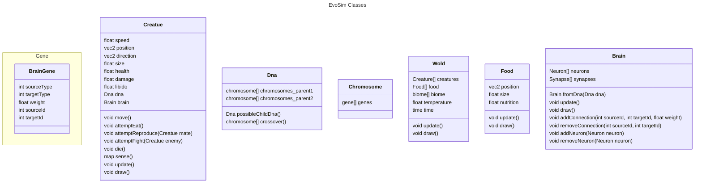

```mermaid
---
title: EvoSim Classes
---
classDiagram

class Creatue {
    float speed
    vec2 position
    vec2 direction
    float size
    float health
    float damage
    float libido
    Dna dna
    Brain brain

    void move()
    void attemptEat()
    void attemptReproduce(Creatue mate)
    void attemptFight(Creatue enemy)
    void die()
    map<int, float> sense()

    void update()
    void draw()
}

class Dna {
    chromosome[] chromosomes_parent1
    chromosome[] chromosomes_parent2

    Dna possibleChildDna()
    chromosome[] crossover()
}

class Chromosome {
    gene[] genes
}

namespace Gene {
    class BrainGene {
        int sourceType
        int targetType
        float weight
        int sourceId
        int targetId
    }
}

class Wold {
    Creature[] creatures
    Food[] food
    biome[] biome
    float temperature
    time time

    void update()
    void draw()
}

class Food {
    vec2 position
    float size
    float nutrition

    void update()
    void draw()
}

class Brain {
    Neuron[] neurons
    Synapse[] synapses

    Brain fromDna(Dna dna)
    void update()
    void draw()
    void addConnection(int sourceId, int targetId, float weight)
    void removeConnection(int sourceId, int targetId)

    void addNeuron(Neuron neuron)
    void removeNeuron(Neuron neuron)
}
```